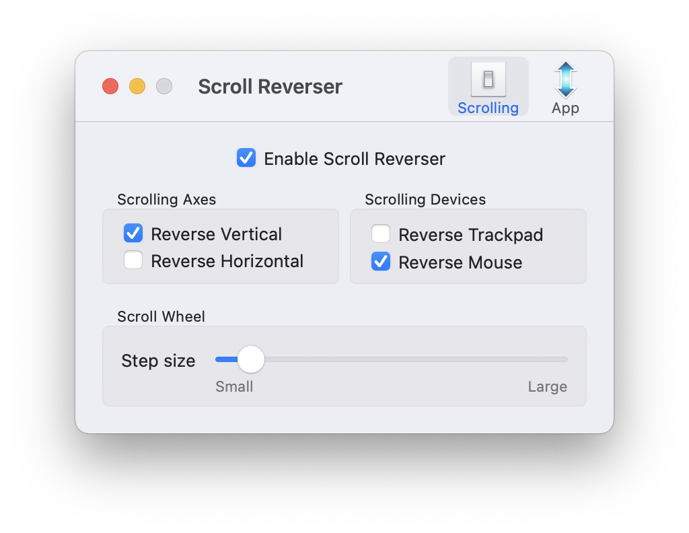
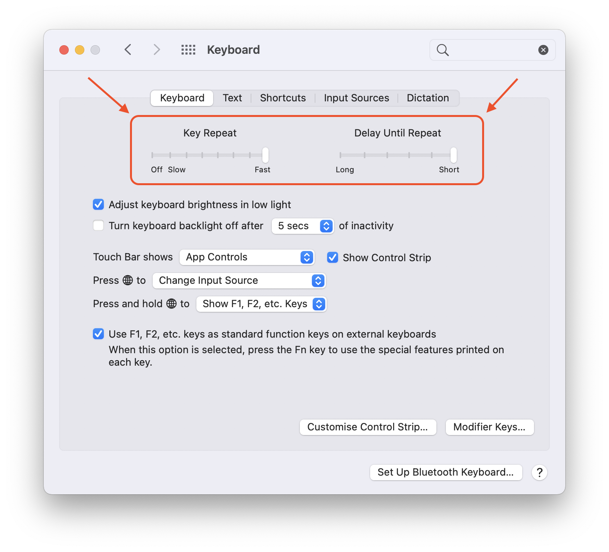

# Developer's environment
## Mac OS
### XCode
```
xcode-select --install
```

### Configs
```
# git
cp .gitconfig ~/

# zshell
cp .zshrc ~/

# karabiner
mkdir -p ~/foo/bar && cp karabiner.json $_

# nvm
mkdir ~/.nvm
```

### ZShell
```
sh -c "$(curl -fsSL https://raw.githubusercontent.com/robbyrussell/oh-my-zsh/master/tools/install.sh)"
```
```
source ~/.zshrc # ?
```
```
# install zshell theme (brew not working)
npm install -g spaceship-zsh-theme
```

### Homebrew
```
# Install
/bin/bash -c "$(curl -fsSL https://raw.githubusercontent.com/Homebrew/install/master/install.sh)"
```
```
# Install packages
brew bundle
```

### iTerm

- Import "iTerm profile.json" profile
- Import "One Dark.itermcolors" theme

### Scroll Reverser

- Setup Scroll Reverser app to have separate scroll direction for trackpad and mouse

  

### Keyboard

- Setup keyboard's repeat settings

  

### VSCode

1. Sign in via "GitHub" to sync settings
2. Run `Shell Command: Install 'code' command in PATH` command to be able to use VSCode as default git editor
